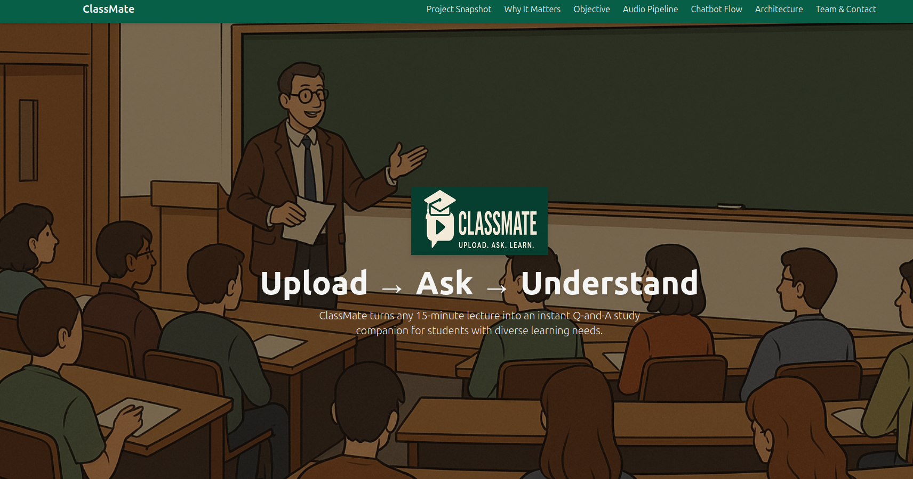

# ClassMate - Capstone Project Website

This repository contains the source code for the ClassMate Capstone Project's informational single-page website. The site explains the project's goals, features, and architecture in a simple, non-technical way.

---

## ✨ Live Website ✨

**The deployed version of this website is live and accessible here:**

### **➡️ [https://classmate-website-wine.vercel.app/](https://classmate-website-wine.vercel.app/) ⬅️**

---

## 📸 Screenshot




## 🚀 Project Goal

ClassMate aims to turn lecture recordings into interactive Q&A study companions, making learning more accessible and efficient, especially for students with diverse learning needs. This website provides a quick overview of the capstone project.

## 🛠️ Technology Stack

*   **HTML5:** For content structure.
*   **Tailwind CSS v3:** For utility-first styling and responsiveness.
*   **Vanilla JavaScript:** For the mobile navigation menu toggle.
*   **Node.js / npm:** For managing dependencies and running build scripts.
*   **live-server:** For local development with auto-reloading.
*   **Vercel:** For hosting and deployment.

## 💻 Running Locally (Development Setup)

Follow these steps to run the website on your local machine for development or testing:

**Prerequisites:**

*   [Node.js](https://nodejs.org/) (which includes npm) installed on your system.

**Steps:**

1.  **Clone the Repository:**
    ```bash
    git clone https://github.com/jacorderopr/classmate-website.git
    cd classmate-website # Or your repository's directory name
    ```

2.  **Install Dependencies:**
    This command downloads Tailwind CSS, `live-server`, and any other necessary development tools defined in `package.json` into a local `node_modules` folder.
    ```bash
    npm install
    ```

3.  **Run Development Tasks:**
    You'll need **two separate terminal windows/tabs** open in the project directory:

    *   **Terminal 1: Start the Tailwind CSS Watcher**
        This command continuously watches your `index.html` and `src/input.css` files. When it detects changes, it automatically rebuilds the `public/dist/output.css` file.
        ```bash
        npm run watch:css
        ```

    *   **Terminal 2: Start the Live Development Server**
        This command starts a local web server using `live-server`, serving the contents of the `public/` directory. It also automatically refreshes your browser whenever files in the `public` directory (including the `output.css` rebuilt by Terminal 1) change.
        ```bash
        npm run dev
        ```

4.  **Access the Website:**
    Your default web browser should automatically open to the local site, typically at an address like `http://127.0.0.1:8080` or `http://localhost:8080` (the port number might vary).

Now you can edit the HTML (`public/index.html`) or CSS (`src/input.css`), save your changes, and see the updates reflected live in your browser without manual refreshes!

## ☁️ Deployment

This website is automatically deployed using [Vercel](https://vercel.com/). Any pushes or merges to the `main` branch of the repository will trigger a new build and deployment cycle. The live link provided above will always point to the latest successfully deployed version.

## 📧 Contact

For questions about the ClassMate project itself, please refer to the contact information provided on the website.